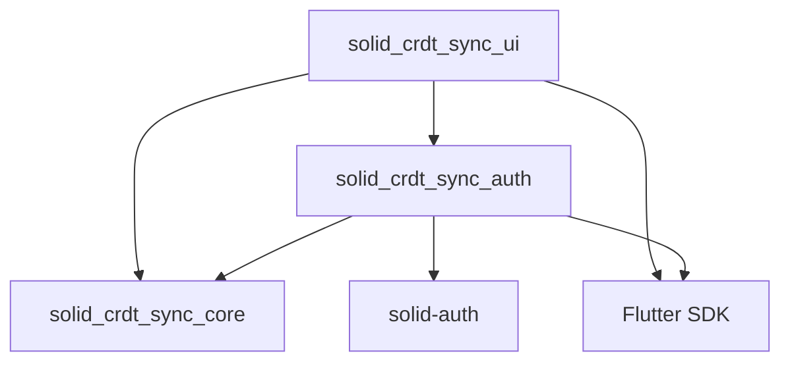

# Implementation Guide - Dart Reference Library

This document covers the Dart reference implementation of the solid_crdt_sync specification.

## Multipackage Structure

The Dart implementation is organized as a monorepo with the following packages:

### Core Packages

- **`solid_crdt_sync_core`**: Platform-agnostic sync logic and CRDT implementations
  - Abstract interfaces (`SolidAuthProvider`, `LocalStorage`)
  - CRDT types (`LwwRegister`, `FwwRegister`, `OrSet`)
  - Hybrid Logical Clock implementation  
  - Sync strategies and engine
  - **Pure Dart** - no platform dependencies

- **`solid_crdt_sync_auth`**: Solid Pod authentication integration
  - Concrete implementation of `SolidAuthProvider`
  - Integration with solid-auth library
  - **Depends on:** Flutter + solid_crdt_sync_core + solid-auth

- **`solid_crdt_sync_ui`**: Flutter UI components
  - `SolidLoginScreen` - Complete login UI with Pod provider selection
  - `SolidProviderPicker` - Widget for choosing Pod providers  
  - `SyncStatusWidget` - Displays sync progress and status
  - **Depends on:** Flutter + solid_crdt_sync_core + solid_crdt_sync_auth

## Quick Start for App Developers

### 1. Add Dependencies to Flutter App

```yaml
dependencies:
  solid_crdt_sync_core:
    path: ../solid_crdt_sync/packages/solid_crdt_sync_core
  solid_crdt_sync_ui:
    path: ../solid_crdt_sync/packages/solid_crdt_sync_ui
```

### 2. Set Up Authentication and Sync

```dart
import 'package:solid_crdt_sync_ui/solid_crdt_sync_ui.dart';

// Configure sync strategy
final syncStrategy = FullSyncStrategy<Recipe>(
  indexPath: '/indices/recipes/',
  syncContract: RecipeContract.v1,
);

// Initialize sync engine
final syncEngine = SyncEngine(
  authProvider: authProvider,
  localStorage: localStorage,
  strategies: [syncStrategy],
);

await syncEngine.initialize();
await syncEngine.syncAll();
```

### 3. Use Ready-Made UI Components

```dart
// Login screen with Pod provider selection
SolidLoginScreen(
  authProvider: authProvider,
  onLoginSuccess: () => Navigator.pushReplacement(...),
)

// Sync status widget
SyncStatusWidget(
  syncEngine: syncEngine,
  onManualSync: () => print('Manual sync triggered'),
)
```

## Development Workflow

### Workspace Setup

This project uses Melos for multipackage management:

```bash
git clone https://github.com/klaaskalass/solid_crdt_sync.git
cd solid_crdt_sync
dart pub get
dart pub run melos bootstrap
```

### Development Commands

```bash
# Run tests across all packages
dart pub run melos test
dart tool/run_tests.dart  # With usage guidance

# Code quality
dart pub run melos analyze
dart pub run melos format
dart pub run melos lint

# Version and release management
dart pub run melos version    # Update versions + changelog
dart pub run melos publish   # Publish to pub.dev
dart pub run melos release   # Preview full release
```

### Package Dependencies



## Implementation Status

| Component | Status | Notes |
|-----------|--------|-------|
| **Core Logic** | 🚧 Interfaces defined | CRDT types and sync engine in progress |
| **Authentication** | 📋 Placeholder | Awaiting solid-auth integration |
| **UI Components** | ✅ Complete | Login forms and sync status widgets |
| **Storage Backends** | 📋 Future | Isar/Drift packages planned |

## Future Package Structure

Additional packages planned:

```
packages/
├── solid_crdt_sync_core/      # ✅ Platform-agnostic core
├── solid_crdt_sync_auth/      # 🚧 Authentication bridge  
├── solid_crdt_sync_ui/        # ✅ Flutter UI components
├── solid_crdt_sync_isar/      # 📋 Isar storage backend
├── solid_crdt_sync_drift/     # 📋 Drift storage backend
└── solid_crdt_sync_hive/      # 📋 Hive storage backend
```

## Architecture Alignment

This implementation follows the 4-layer architecture defined in the specification:

1. **Data Resource Layer** → Core RDF handling in `solid_crdt_sync_core`
2. **Merge Contract Layer** → CRDT implementations in `solid_crdt_sync_core`  
3. **Indexing Layer** → Performance optimization in `solid_crdt_sync_core`
4. **Sync Strategy Layer** → Application strategies in `solid_crdt_sync_core`

Platform-specific concerns (authentication, storage, UI) are separated into dedicated packages while keeping the core logic pure and reusable.